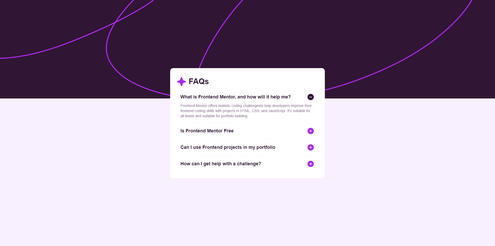
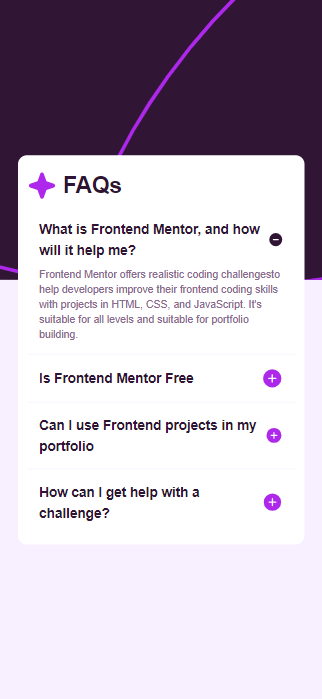
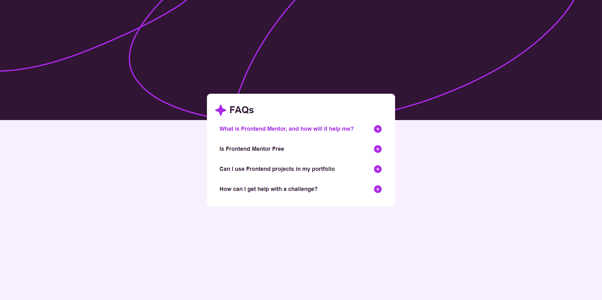

# Frontend Mentor - FAQ accordion solution

This is a solution to the [FAQ accordion challenge on Frontend Mentor](https://www.frontendmentor.io/challenges/faq-accordion-wyfFdeBwBz). 

## Table of contents

- [Overview](#overview)
    - [The challenge](#the-challenge)
    - [Screenshot](#screenshot)
    - [Links](#links)
- [My process](#my-process)
    - [Built with](#built-with)
    - [What I learned](#what-i-learned)
    - [Continued development](#continued-development)
    - [Useful resources](#useful-resources)
- [Author](#author)

## Overview

### The challenge

Users should be able to:

- Hide/Show the answer to a question when the question is clicked
- Navigate the questions and hide/show answers using keyboard navigation alone
- View the optimal layout for the interface depending on their device's screen size
- See hover and focus states for all interactive elements on the page

### Screenshot





### Links

- Solution URL: [Github](https://github.com/Erhahon-Imafidon/accordion)
- Live Site URL: [Accordion](https://accordion-xi-blond.vercel.app/)

## My process

### Built with

- Semantic HTML5 markup
- CSS custom properties
- Flexbox
- Mobile-first workflow
- [React](https://reactjs.org/) - JS library
- [Tailwind CSS](https://tailwindcss.com/) - For styles

### What I learned

I learnt how to quickly code a faq page using custom accordion with React and  tailwind css. And how to make the first Accordion be opened by default

To see how you can add code snippets, see below:

### I am very proud of this section element on how it can be a flex container and it can let you center the rest component


```js
<section className='bg-mobile md:bg-desktop bg-cover h-2/5 absolute inset-0'></section>
```
```js
 <main className='font-workSans bg-light-pink w-full h-screen relative flex flex-col justify-center items-center px-6'>
  <section className='bg-mobile md:bg-desktop bg-cover h-2/5 absolute inset-0'></section>
  <AccordionContainer />
</main>
```

### Useful resources

- [Tailwind CSS Documentation](https://tailwindcss.com/docs) - This helped me understand how to use utility-first CSS for rapid UI development.
- [React Documentation](https://reactjs.org/docs/getting-started.html) - This is an amazing resource for understanding React concepts and best practices.

## Author

- Frontend Mentor - [Erhahon Imafidon](https://www.frontendmentor.io/profile/Erhahon-Imafidon)
- Twitter - [@ImafidonErhahon](https://x.com/ImafidonErhahon)

